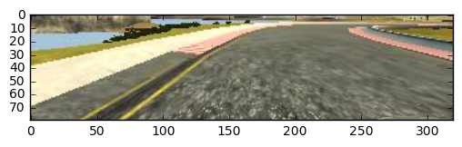

# [Udacity Self Driving Car Nanodegree](https://www.udacity.com/drive)

## Project 3: Bahaviroal Cloning

### Project Overview

1. Drive the car in the **training mode** of the Udaicty simulator to collect training data. 
2. Clone the behavior of the car by training a neural network **end-to-end** with the collected training data.
3. Use the trained model to drive the car in the **autonomous mode** of the Udacity simulator.

---

### Data Collection

Three laps of the track and another three laps in the opposite direction are recorded. Images from both left, center, and right cameras are used as the training data. The total number of image is around 15k. The training script `model.py` has the command line option to train on center images only.

The key to this project is to get data which can help **recovering from excursion**. Otherwise, your car will always drive straight and when it is out of the runway it will never recover from it, such as below:

---
### Data Processing

1. Data is loaded with **Pandas**. The images from left, center, and right cameras are concatenated to form a two-column dataframe: **Image** and **Steering**.
2. Images are first cropped to get rid of the sky and trees in the upper side and the car front in the lower side. Then they are resized to **66 by 200 by 3** before converted to **YUV** color space. The size and the color space are obtained from **[the Nvidia paper](end-to-end-dl-using-px.pdf)**. Note that the same image transformation has to be done in **[drive.py](drive.py)** as well so that the model always gets the same format of input. Below is an example pipeline of the image processing:
      
      **original image (160 x 320 x 3):**
      
        
      **Cropped image (80 x 320 x 3):**        
      
        
      **Resized image (66 x 200 x 3):**
      
        
      **YUV image (66 x 200 x 3):**
      
        

3. Since in the **autonomous mode** only the center images are used, we need to adjust the left and right images as if they are taken by the center cameras. All the steering angles from the left images are added a random value from 0.1 to 0.5, and all the steering angles from the right images are added a random value from -0.1 to -0.5.
4. A **image generator** is developed to load the images on the fly. Avoid to load all images at once can save a lot of memories when image number is big. The **image generator** is called by **Keras fit_generator()** to provide the trainning data.

---
### Model

The model is obtained from [the Nvidia paper](end-to-end-dl-using-px.pdf), built with **Keras**, and have total **147,148 parameters**. The summary of the model is shown as below:

 

| Layer (type) | Output Shape | Param # | Connected to |
| :--- | :--- | ---: | :--- |
| lambda_1 (Lambda) | (None, 66, 200, 3)| 0 | lambda_input_1[0][0] |
| convolution2d_1 (Convolution2D) | (None, 33, 100, 5)| 1805 | lambda_1[0][0] |
| elu_1 (ELU) | (None, 16, 50, 5) | 0 | convolution2d_1[0][0] |
| convolution2d_2 (Convolution2D) |(None, 8, 25, 5) | 4505 | elu_1[0][0] |
| elu_2 (ELU) |(None, 8, 25, 5) | 0 | convolution2d_2[0][0] |
| convolution2d_3 (Convolution2D) |(None, 4, 13, 5) | 6005 | elu_2[0][0] |
| elu_3 (ELU) |(None, 4, 13, 5) | 0 | convolution2d_3[0][0] |
| convolution2d_4 (Convolution2D) |(None, 2, 7, 3) | 2883 | elu_3[0][0] |
| elu_4 (ELU) |(None, 2, 7, 3) | 0 | convolution2d_4[0][0] |
| convolution2d_5 (Convolution2D) |(None, 1, 4, 3) | 1731 | elu_4[0][0] |
| flatten_1 (Flatten) | (None, 12) | 0 | convolution2d_5[0][0] |
| dropout_1 (Dropout) | (None, 12) | 0 | flatten_1[0][0] |
| elu_5 (ELU) | (None, 12) | 0 | dropout_1[0][0] |
| dense_1 (Dense) | (None, 1164) | 8148 | elu_5[0][0] |
| dropout_2 (Dropout) | (None, 1164) | 0 | dense_1[0][0] |
| elu_6 (ELU) | (None, 1164) | 0 | dropout_2[0][0] |
| dense_2 (Dense) | (None, 100) | 116500 | elu_6[0][0] |
| dropout_3 (Dropout) | (None, 100) | 0 | dense_2[0][0] |
| elu_7 (ELU) | (None, 100) | 0 | dropout_3[0][0] |
| dense_3 (Dense) | (None, 50) | 5050 | elu_7[0][0] |
| dropout_4 (Dropout) | (None, 50) | 0 | dense_3[0][0] |
| elu_8 (ELU) | (None, 50) | 0 | dropout_4[0][0] |
| dense_4 (Dense) | (None, 10) | 510 | elu_8[0][0] |
| dropout_5 (Dropout) | (None, 10) | 0 | dense_4[0][0] |
| elu_9 (ELU) | (None, 10) | 0 | dropout_5[0][0] |
| dense_5 (Dense) | (None, 1) | 11 | elu_9[0][0] |

---
### Summary

---
