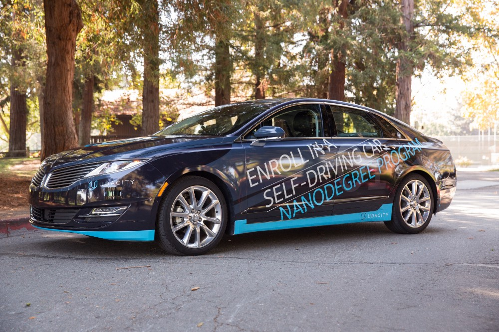

# [Udacity Self-Driving Car Nanodegree](https://www.udacity.com/course/self-driving-car-engineer-nanodegree--nd013) 

This repository contains all the projects I have completed for the [Self-Driving Car Nanodegree](https://www.udacity.com/drive) offered by [Udacity](https://www.udacity.com). There are over 11,000 people applied for this Nanodegree progam and I was selected as one of the 500 students for the very first cohort started in October 2016. The curriculum of this program consists of three terms over nine months. This repository will be updated with my progress accordingly. 

## Term 1:  [Computer Vision and Deep Learning](https://medium.com/self-driving-cars/term-1-in-depth-on-udacitys-self-driving-car-curriculum-ffcf46af0c08#.nglkprlow)

| #  | Title           |  Solution       | Techniques      | Libraries      | Dataset  |
:---:|:--------------- | :-------------- | :-------------- | :--------------| :--------------
| 1 | [Finding Lane Lines](Term1/P1_Find_Lane_Lines/) | [Python](Term1/P1_Find_Lane_Lines/P1.ipynb) | [Color Space Conversion](http://docs.opencv.org/3.1.0/de/d25/imgproc_color_conversions.html), [Canny Edge Detection](http://docs.opencv.org/trunk/da/d22/tutorial_py_canny.html), [Hough Transformation](http://docs.opencv.org/2.4/doc/tutorials/imgproc/imgtrans/hough_lines/hough_lines.html) | [OpenCV](http://opencv.org/), [MoviePy](http://zulko.github.io/moviepy/) | [Udacity](https://github.com/udacity/CarND-LaneLines-P1) |
| - | [TensorFlow Lab](Term1/Lab_TensorFlow/) | [Python](Term1/Lab_TensorFlow/lab.ipynb) | [Neural Network](https://en.wikipedia.org/wiki/Artificial_neural_network), [Min-Max Scaling](http://scikit-learn.org/stable/modules/generated/sklearn.preprocessing.MinMaxScaler.html) | [TensorFlow](https://www.tensorflow.org/), [Scikit-Learn](http://scikit-learn.org/), [tqdm](https://github.com/noamraph/tqdm) | [notMNIST](http://yaroslavvb.blogspot.com/2011/09/notmnist-dataset.html) |
| 2 | [Traffic Sign Classifier](Term1/P2_Traffic_Signs/) | [Python](Term1/P2_Traffic_Signs/Traffic_Signs_Recognition.ipynb) | [Convolutional Neural Network](https://en.wikipedia.org/wiki/Convolutional_neural_network), [Relu](https://en.wikipedia.org/wiki/Rectifier_(neural_networks)), [Pooling](http://ufldl.stanford.edu/tutorial/supervised/Pooling/), [Dropout](https://www.cs.toronto.edu/~hinton/absps/JMLRdropout.pdf), [Regularization](https://en.wikipedia.org/wiki/Regularization_(mathematics)) | [TensorFlow](https://www.tensorflow.org/), [Scikit-Learn](http://scikit-learn.org/) | [German Traffic Sign Dataset](http://benchmark.ini.rub.de/?section=gtsrb&subsection=dataset) || 
| - | [Keras Lab](Term1/Lab_Keras/) | [Python](Term1/Lab_Keras/traffic-sign-classification-with-keras.ipynb) | [Keras Models](https://keras.io/models/about-keras-models/), [Keras Layers](https://keras.io/layers/about-keras-layers/) | [Keras](https://keras.io/) | [German Traffic Sign Dataset](http://benchmark.ini.rub.de/?section=gtsrb&subsection=dataset) |
| - | [AlexNet Lab](Term1/Lab_AlexNet/) | [Python](Term1/Lab_AlexNet/train_feature_extraction.py) | [Transfer Learning](http://cs231n.github.io/transfer-learning/), [AlexNet](https://github.com/BVLC/caffe/tree/master/models/bvlc_alexnet) | [Tensorflow](https://www.tensorflow.org/), [Scikit-Learn](http://scikit-learn.org/) | [German Traffic Sign Dataset](http://benchmark.ini.rub.de/?section=gtsrb&subsection=dataset) |
| - | [Transfer Learning Lab](Term1/Lab_Transfer_Learning/) | [Python](Term1/Lab_Transfer_Learning/feature_extraction.py) | [Transfer Learning](http://cs231n.github.io/transfer-learning/), [VGG](http://www.robots.ox.ac.uk/~vgg/research/very_deep/), [ResNet](https://github.com/KaimingHe/deep-residual-networks), [GoogLeNet](https://github.com/BVLC/caffe/tree/master/models/bvlc_googlenet) | [Tensorflow](https://www.tensorflow.org/), [Keras](https://keras.io/) | [German Traffic Sign Dataset](http://benchmark.ini.rub.de/?section=gtsrb&subsection=dataset), [CIFAR-10](https://www.cs.toronto.edu/~kriz/cifar.html) |
| 3 | [Behavioral Cloning](Term1/P3_Bahavioral_Cloning/) | [Python](Term1/P3_Bahavioral_Cloning/model.py) | [End-to-End Learning](Term1/P3_Bahavioral_Cloning/end-to-end-dl-using-px.pdf) | [Keras](https://keras.io/), [JSON](http://www.json.org/), [Pandas](http://pandas.pydata.org/) | [Udacity Simulator](https://github.com/udacity/self-driving-car-sim) |
| 4 | [Advanced Lane Finding](Term1/P4_Advanced_Lane_Lines/) | [Python](Term1/P4_Advanced_Lane_Lines/P4.ipynb) |[Camera Calibration](http://docs.opencv.org/2.4/doc/tutorials/calib3d/camera_calibration/camera_calibration.html), [Perspective Transformation](http://docs.opencv.org/2.4/modules/imgproc/doc/geometric_transformations.html), [Sobel Operator](http://docs.opencv.org/2.4/doc/tutorials/imgproc/imgtrans/sobel_derivatives/sobel_derivatives.html), [Color Conversion](http://docs.opencv.org/3.1.0/de/d25/imgproc_color_conversions.html), [Image Thresholding](http://docs.opencv.org/trunk/d7/d4d/tutorial_py_thresholding.html) | [OpenCV](http://opencv.org/) | [Images](Term1/P4_Advanced_Lane_Lines/test_images/), [Videos](Term1/P4_Advanced_Lane_Lines/videos/) |
| 5 | [Vehicle Detection](Term1/P5_Vehicle_Detection/) | [Python](Term1/P5_Vehicle_Detection/P5_Vehicle_Detection.ipynb) | [Template Matching](http://opencv-python-tutroals.readthedocs.io/en/latest/py_tutorials/py_imgproc/py_template_matching/py_template_matching.html), [Color Histogram](http://docs.opencv.org/trunk/d1/db7/tutorial_py_histogram_begins.html), [HOG](http://scikit-image.org/docs/dev/auto_examples/plot_hog.html), [LinearSVC](http://scikit-learn.org/stable/modules/generated/sklearn.svm.LinearSVC.html), [Heatmap](https://en.wikipedia.org/wiki/Heat_map) |  [OpenCV](http://opencv.org/), [Scikit-Learn](http://scikit-learn.org/), [Skimage](http://scikit-image.org/docs/dev/api/skimage.html), [Scipy](https://www.scipy.org/), [MoviePy](http://zulko.github.io/moviepy/) | [Images](Term1/P5_Vehicle_Detection/test_images/), [Video](Term1/P5_Vehicle_Detection/project_video.mp4) |

## Term 2:  [Sensor Fusion, Localization, and Control](https://medium.com/@dsilver829/term-2-in-depth-on-udacitys-self-driving-car-curriculum-775130aae502#.sk03pvahx)

| #  | Title           |  Solution       | Techniques      | Libraries      | Dataset  |
:---:|:--------------- | :-------------- | :-------------- | :--------------| :--------------
| - | [Kalman Filter Lab](Term2/Lab_Kalman_Filter/) | [Python](Term2/Lab_Kalman_Filter/kalman_filter.py) | [Kalman Filter](https://en.wikipedia.org/wiki/Kalman_filter) | N/A | N/A |
| 1 | [Extended Kalman Filter](Term2/P1_Extended_Kalman_Filter/) | [C++](Term2/P1_Extended_Kalman_Filter/src/) | [Kalman Filter](https://en.wikipedia.org/wiki/Kalman_filter), [Extended Kalman Filter](https://en.wikipedia.org/wiki/Extended_Kalman_filter), [Lidar](https://en.wikipedia.org/wiki/Lidar), [Radar](https://en.wikipedia.org/wiki/Radar) | [Eigen](http://eigen.tuxfamily.org/) | [Laser & Radar](Term2/P1_Extended_Kalman_Filter/data/) |
| 2 | [Unscented Kalman Filter](Term2/P2_Unscented_Kalman_Filter/) | [C++](Term2/P2_Unscented_Kalman_Filter/src/) | [Kalman Filter](https://en.wikipedia.org/wiki/Kalman_filter), [Unscented Kalman Filter](http://www.cs.unc.edu/~welch/kalman/media/pdf/Julier1997_SPIE_KF.pdf), [Lidar](https://en.wikipedia.org/wiki/Lidar), [Radar](https://en.wikipedia.org/wiki/Radar) |  [Eigen](http://eigen.tuxfamily.org/) | [Laser & Radar](Term2/P2_Unscented_Kalman_Filter/data/)
| - | [Bayesian Filter Lab](Term2/Lab_Bayesian_Filter/) | [C++](Term2/Lab_Bayesian_Filter/bayesianFilter.cpp) | [Bayes' Theorem](https://en.wikipedia.org/wiki/Bayes%27_theorem), [Law of Total Probability](https://en.wikipedia.org/wiki/Law_of_total_probability), [Markov Chain](https://en.wikipedia.org/wiki/Markov_chain), [Hidden Markov Model](https://en.wikipedia.org/wiki/Hidden_Markov_model), [Bayesian Filter](https://en.wikipedia.org/wiki/Recursive_Bayesian_estimation) | N/A | N/A |
| - | [Particle Filter Lab](Term2/Lab_Particle_Filter/) | [Python](Term2/Lab_Particle_Filter/robot.py) | [Particle Filter](https://en.wikipedia.org/wiki/Particle_filter), [Importance Sampling](https://en.wikipedia.org/wiki/Importance_sampling), [Resampling Wheel](https://www.youtube.com/watch?v=wNQVo6uOgYA) | [Robot](Term2/Lab_Particle_Filter/robot.py) | N/A |
| 3 | [Particle Filter](Term2/P3_Particle_Filter/) | [C++](Term2/P3_Particle_Filter/src/) | [Markov Localization & Bayes Filtering](http://web.cs.dal.ca/~tt/CSCI415511/MLBayesFilterTT.pdf), [Particle Filter](https://en.wikipedia.org/wiki/Particle_filter) | N/A | [Map](Term2/P3_Particle_Filter/data/map_data.txt), [Control](Term2/P3_Particle_Filter/data/control_data.txt), [Observation](Term2/P3_Particle_Filter/data/observation/) |
| - | [PID Controller Lab](Term2/Lab_PID_Controller/) | [Python](Term2/Lab_PID_Controller/pid_controller.py) | [PID Controller](https://en.wikipedia.org/wiki/PID_controller), [Coordinate Descent](https://en.wikipedia.org/wiki/Coordinate_descent) | [Robot](Term2/Lab_PID_Controller/robot.py) | N/A |
| 4 | [PID Controller](Term2/P4_PID_Controller/) | [C++](Term2/P4_PID_Controller/src/PID.cpp) | [PID Controller](https://en.wikipedia.org/wiki/PID_controller)| N/A | [Udacity Simulator](https://github.com/udacity/self-driving-car-sim) |
| - | [MPC Lab](Term2/Lab_Model_Predictive_Control/) | [C++](Term2/Lab_Model_Predictive_Control/mpc_to_line/src/MPC.cpp) | [Model Predictive Control](https://en.wikipedia.org/wiki/Model_predictive_control), [Kinematic Model](http://www.me.berkeley.edu/~frborrel/pdfpub/IV_KinematicMPC_jason.pdf), [Polynominal](https://en.wikipedia.org/wiki/Polynomial) | [Eigen](http://eigen.tuxfamily.org/), [Ipopt](https://projects.coin-or.org/Ipopt), [CppAD](https://www.coin-or.org/CppAD/)| N/A |
| 5 | [Model Predictive Control](Term2/P5_Model_Predictive_Control/) | [C++](Term2/P5_Model_Predictive_Control/src/MPC.cpp) | [Model Predictive Control](https://en.wikipedia.org/wiki/Model_predictive_control) | [Eigen](http://eigen.tuxfamily.org/), [Ipopt](https://projects.coin-or.org/Ipopt), [CppAD](https://www.coin-or.org/CppAD/), [uWebSockets](https://github.com/uNetworking/uWebSockets) | [Udacity Simulator](https://github.com/udacity/self-driving-car-sim) |
